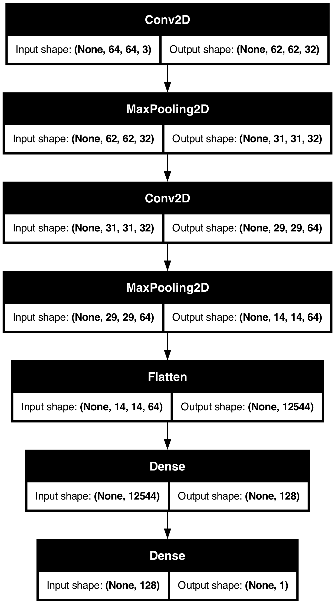
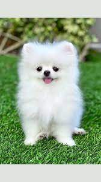

# 🐶🐱 Cat vs Dog Image Classifier

This project is a simple Convolutional Neural Network (CNN) built using TensorFlow and Keras to classify images of cats and dogs. It trains on a subset of the popular [Dogs vs. Cats dataset](https://www.kaggle.com/c/dogs-vs-cats/data) and outputs whether an input image is a cat or a dog.

---

## 📂 Project Structure

```txt
.
├── Dogs-vs-Cats/ # Dataset directory
├── cat_dog_classifier.py # Model training script
├── predict.py # Predict from a single image
├── classifier.py # (Optional) Additional classification logic
├── view_model_architecture.py # Visualizes model architecture
├── inspect_layer_weights_activations.py # Inspect internal CNN layers
├── cat_dog_classifier.h5 # Trained model file
├── model.png # Model architecture diagram
├── model_architecture_summary.png # Text-based summary as image
├── Layer_Weights_and_Activations.png # CNN intermediate activations
├── test1.jpeg / test2.jpeg / test3.jpg # Sample test images
├── test.png
└── README.md # Project documentation (this file)
```


# Related Theory Notes
## 📥 Dataset

The dataset used is the **Dogs vs Cats** dataset from Kaggle.

🔗 Dataset:
https://www.kaggle.com/c/dogs-vs-cats/data

The dataset is **not included** in this repository because of its large size.

---

## Dataset Setup

Create the dataset directory:

```bash
mkdir -p Dogs-vs-Cats
```

Download and extract the dataset from Kaggle into:

```text
CNN/Dogs-vs-Cats/
```

Expected structure:

```text
Dogs-vs-Cats/
├── train/
│   ├── cats/
│   └── dogs/
├── validation/
│   ├── cats/
│   └── dogs/
└── test/
```

---

## Kaggle CLI Download (Optional)

Install Kaggle CLI:

```bash
pip install kaggle
```

Download dataset:

```bash
kaggle competitions download -c dogs-vs-cats
```

Extract:

```bash
unzip dogs-vs-cats.zip -d Dogs-vs-Cats
```


## 🧠 Training the Model

Run the following script to train and save the model:

```bash
python cat_dog_classifier.py
```

## 🧠 Model Architecture

The CNN architecture includes:
- Two Conv2D layers with ReLU activations
- Two MaxPooling2D layers
- One Dense hidden layer with 128 neurons
- A final output layer with sigmoid activation (for binary classification)

<p align="center">
  
</p>

---

## 🏗️ How to Train

Ensure you have the training and testing images in this structure:

```txt
Dogs-vs-Cats/
├── training_set/
│ ├── cats/
│ └── dogs/
├── test_set/
├── cats/
└── dogs/
```

Then run:

```bash
python cat_dog_classifier.py

```

This will:

+ Preprocess the dataset

+ Train the CNN model for 10 epochs

+ Save the model as `cat_dog_classifier.h5`

## 🔍 Predicting New Images

To make a prediction on a new image (e.g., `test1.jpeg`), run:

```sh
python predict.py
```

Make sure to update the `img_path` in `predict.py` accordingly.


## 🧪 Visualization
+ `model.png`: Visual representation of the CNN architecture.

+ `Layer_Weights_and_Activations.png`: Visualizations of internal layers/activations.

+ `model_architecture_summary.png`: Layer-by-layer summary of the model.


## 🛠️ Dependencies
+ Python 3.11

+ TensorFlow 2.x

+ matplotlib

+ numpy

Install all required packages with:

```sh
pip install tensorflow matplotlib
```

## 🤖 Model Summary
+ 2 Conv2D + MaxPooling layers

+ Fully connected Dense layer

+ Output: binary classification with sigmoid

## 📸 Sample Predictions
<p float="left"> 
    
    
     
</p>

Run predict.py on these to see the classification results.
